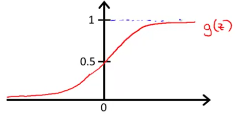
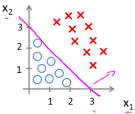
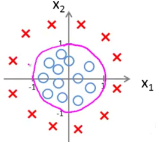
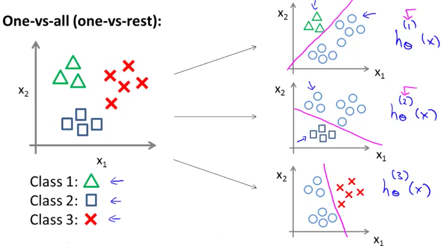
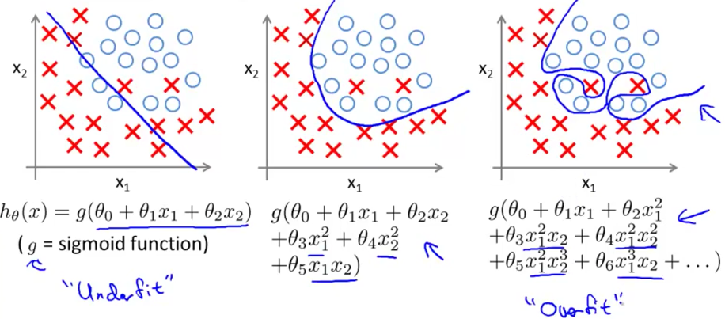
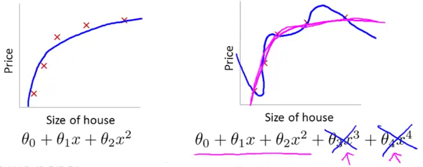

# Logistic Regression

## Classification and Representation

### Classification

* Calssification Problem
  * $y\in {0,1}$
    * 0: "Negative Class",  负类
    * 1: "Positive Class", 正类
  * One method is to use linear regression and map all predictions greater than 0.5 as a 1 and all less than 0.5 as a 0. This method doesn't work well because classification is not actually a linear function.
* Logistic Regression (逻辑回归) : $0\le h_\theta \le 1$


### Hypothesis Representation

#### Logistic Regression Model

$h_\theta (x) = \frac{1}{1+e^{-\theta ^T x}}​$

* Want $0\le h_\theta(x)\le 1$

  * $h_\theta (x) = g(\theta ^T x)$

  * $g(z) = \frac{1}{1+e^{-z}}$

    * Called "Sigmod function" or "Logistic function"

      

#### Interpretation of Hypothesis Output

* $h_\theta (x)$ = estimated probability that $y=1$ on input $x$
  * $h_\theta (x) = P(y=1|x; \theta)$
    * probability that $y=1$, given $x$, parameterised by $\theta$.
  * $P(y=0|x;\theta ) = 1 - P(y=1|x;\theta )$

### Decision Boundary

In order to get our discrete 0 or 1 classification, we can suppose

* $h_\theta(x) \geq 0.5 \rightarrow y = 1$
* $h_\theta(x) < 0.5 \rightarrow y = 0$

The way our logistic function $g$ behaves is that when its input is greater than or equal to zero, its output is greater than or equal to 0.5:

* $g(z) \ge 0.5$ when $z\ge 0$, i.e., $\theta ^T x \ge 0$

In conclusion, we can now say:

* $\theta^T x \geq 0 \Rightarrow y = 1$
* $\theta^T x < 0 \Rightarrow y = 0$

#### Decision boundaries

The **decision boundary** is the line that separates the area where $y=0$ and where $y=1$. It is created by our hypothesis function $\theta^T x = 0$.



The decision boundary is a property, not of the trading set, but of the hypothesis $h_\theta(x)$ under the parameters. As long as we're given parameter vector $\theta$, that defines the decision boundary. <u>But the training set is not what we use to define the decision boundary.</u>

#### Non-linear decision boundaries

The input to the sigmoid function $g(z)$ (e.g. $\theta ^T x$) doesn't need to be linear, and could be a function that describes a circle (e.g. $z = \theta_0 + \theta _1 x_1 + \theta _2 x_2 + \theta _3 x_1^2 + \theta _4 x_2^2$) or any shape to fit our data.



## Logistic Regression Model
### Cost Function

We cannot use the same cost function that we use for linear regression because the Logistic Function will cause the output to be wavy, causing many local optima. In other words, it will not be a convex function (凸函数).


Instead, our cost function for logistic regression looks like:

$J(\theta) = \dfrac{1}{m} \sum_{i=1}^m \mathrm{Cost}(h_\theta(x^{(i)}),y^{(i)})$

$\mathrm{Cost}(h_\theta(x),y) = \begin{cases}-\log(h_\theta(x)) ,&\text{if y = 1}\newline -\log(1-h_\theta(x)) ,&\text{if y = 0}\end{cases}$

* $\mathrm{Cost} = 0$ if $y=1, h_\theta (x)=1$
* But as $h_\theta (x) \to 0, \mathrm{Cost} \to \infty$
  * Captures intuition that if $h_\theta (x) = 0$ (predict $P(y=1|x;\theta ) = 0$), but $y=1$, we'll **penalise** learning algorithm by a very large cost.


### Simplified Cost Function and Gradient Descent

#### Simplified Cost Function

We can compress our cost function's two conditional cases into one case:

$\mathrm{Cost}(h\_\theta(x),y) = - y \log(h\_\theta(x)) - (1 - y) \log(1 - h_\theta(x))$

We can fully write out our entire cost function as follows:

$J(\theta) = - \frac{1}{m} \sum\_{i=1}^m [y^{(i)}\log (h\_\theta (x^{(i)})) + (1 - y^{(i)})\log (1 - h\_\theta(x^{(i)}))]$

* This cost function can be derived from statistics using the principle of maximum likelihood estimation (极大似然估计). Which is an idea in statistics for how to efficiently find parameters' data for different models.
* And it also has a nice property that it is convex.

A vectorized implementation is:

$h = g(X\theta)$

$ J(\theta)  = \frac{1}{m} \cdot \left(-y^{T}\log(h)-(1-y)^{T}\log(1-h)\right)$

#### Gradient Descent

$Repeat \lbrace \\\\ \theta_j := \theta_j - \alpha \dfrac{\partial}{\partial \theta\_j}J(\theta)= \theta\_j - \frac{\alpha}{m} \sum\_{i=1}^m (h_\theta(x^{(i)}) - y^{(i)}) x_j^{(i)} \\\\ \rbrace$

* Notice that this algorithm is identical to the one we used in linear regression (only $h_\theta (x)$ changes). We still have to simultaneously update all values in theta.

* A vectorized implementation is:

  $\theta := \theta - \frac{\alpha}{m} X^{T} (g(X \theta ) - \vec{y})$

* To make sure th learning rate $\alpha$ is set properly, you can plot $J(\theta)$ as a function of the number of iterations and make sure $J(\theta )$ is decreasing on every iteration.

### Advanced Optimization

Optimization algorithms

* Gradient descent
* Conjugate gradient
* BFGS
* L-BFGS

The avdantage of last three algorithms:

* No need to manually pick $\alpha$
* Often faster than gradient descent

Disadvantages:

* More complex

#### Example

We first need to provide a function that evaluates the following two functions for a given input value $\theta$ :

* $J(\theta )$
* $\frac{\partial}{\partial \theta _j} J(\theta )$

We can write a single function that returns both of these:

```octave
function [jVal, gradient] = costFunction(theta)
  jVal = [...code to compute J(theta)...];
  gradient = [...code to compute derivative of J(theta)...];
end
```

Then we can use octave's "fminunc()" optimization algorithm along with the "optimset()" function that creates an object containing the options we want to send to "fminunc()".

```octave
options = optimset('GradObj', 'on', 'MaxIter', 100);
initialTheta = zeros(2,1);
[optTheta, functionVal, exitFlag] = fminunc(@costFunction, initialTheta, options);
```

## Multiclass Classification: One-vs-all

Instead of $y = {0,1}$, we will expand our definition so that $y = {1,2…n}$. In this case we divide our problem into $n$ binary classification problems; in each one, we predict the probability that 'y' is a member of one of our classes.

That is, we can train a logistic regression classifier $h_\theta ^{(i)} (x)$ for each class $i$ to predict the probability that $y=i$.

$h_\theta^{(i)}(x) = P(y = i | x ; \theta)\ \ \ \  (i=1,2,3,\dots , n+1)$

On a new input $x$, to make a prediction, pick the class $i$ that maximizes $h_\theta ^{(i)} (x)$.



# Regularization

## Solving the Problem of Overfitting

### The Problem of Overfitting


* **High bias** or **underfitting** is when the form of our hypothesis function h maps poorly to the trend of the data. It is usually caused by a function that is too simple or uses too few features. eg. if we take $h_\theta (x)=\theta _0+\theta _1x_1+\theta _2x_2$ then we are making an initial assumption that a linear model will fit the training data well and will be able to generalize but that may not be the case.
* At the other extreme, **overfitting** or **high variance** is caused by a hypothesis function that fits the available data but does not generalize (泛化) well to predict new data. It is usually caused by a complicated function that creates a lot of unnecessary curves and angles unrelated to the data.

This terminology is applied to both linear and logistic regression.



There are **two** main options to address the issue of overfitting:

1. Reduce the number of features.
   * Manually select which features to keep.
   * Use a model selection algorithm (later in the course).
2. Regularization (正则化)
   * Keep all the features, but reduce the parameters $\theta _j$.

Regularization works well when we have a lot of slightly useful features.

### Cost Function

#### Intuition

If we have overfitting from our hypothesis function, we can reduce the weight that some of the terms in our function carry by increasing their cost.

Say we wanted to make the following function more quadratic:

$\theta_0 + \theta_1x + \theta_2x^2 + \theta_3x^3 + \theta_4x^4$

We'll want to eliminate the influence of $\theta _3x_3$ and $\theta _4x_4$. Without actually getting rid of these features or changing the form of our hypothesis, we can instead modify our **cost function**:

$min_\theta\ \dfrac{1}{2m}\sum_{i=1}^m (h_\theta(x^{(i)}) - y^{(i)})^2 + 1000\cdot\theta_3^2 + 1000\cdot\theta_4^2$

We've added two extra terms at the end to inflate the cost of $\theta_3$ and $\theta_4$. Now, in order for the cost function to get close to zero, we will have to reduce the values of $\theta_3$ and $\theta_4$ to near zero. This will in turn greatly reduce the values of $\theta _3x_3$ and $\theta _4x_4$ in our hypothesis function.



#### Regularization

We could also regularize all of our theta parameters in a single summation:

$min_\theta\ \dfrac{1}{2m}\ \left[ \sum_{i=1}^m (h_\theta(x^{(i)}) - y^{(i)})^2 + \lambda\ \sum_{j=1}^n \theta_j^2 \right]$

The $\lambda$, or lambda, is the **regularization parameter**. It determines how much the costs of our theta parameters are inflated. 

* Using the above cost function with the extra summation, we can smooth the output of our hypothesis function to reduce overfitting. 
* If lambda is chosen to be too large, it may smooth out the function too much and cause underfitting. (fails to fit even the training set).

### Regularized Linear Regression

#### Gradient Descent

We will modify our gradient descent function to separate out $\theta_0$ from the rest of the parameters because **we do not want to penalize $\theta_0$.**

$\text{Repeat}\ \lbrace \\\\ \ \ \ \ \theta_0 := \theta_0 - \alpha\ \frac{1}{m}\ \sum_{i=1}^m (h_\theta(x^{(i)}) - y^{(i)})x_0^{(i)} \\\\ \ \ \ \ \theta_j := \theta_j - \alpha\ \left[ \left( \frac{1}{m}\ \sum_{i=1}^m (h_\theta(x^{(i)}) - y^{(i)})x_j^{(i)} \right) + \frac{\lambda}{m}\theta_j \right] \ \ \ \ \ \ \ \ \ \ j \in \lbrace 1,2...n\rbrace \\\\ \rbrace$

* The term $\frac{\lambda}{m}\theta_j$ performs our regularization.

With some manipulation our update rule can also be represented as:

$\theta_j := \theta_j(1 - \alpha\frac{\lambda}{m}) - \alpha\frac{1}{m}\sum_{i=1}^m(h_\theta(x^{(i)}) - y^{(i)})x_j^{(i)}$

* The first term in the above equation, $1 - \alpha\frac{\lambda}{m}$ will always be less than 1. Intuitively you can see it as reducing the value of $\theta _j$ by some amount on every update.
* Notice that the second term is now exactly the same as it was before.

#### Normal Equation

To add in regularization, the equation is the same as our original, except that we add another term inside the parentheses:

$\theta = \left( X^TX + \lambda \cdot L \right)^{-1} X^Ty$

$L = \begin{bmatrix} 0 & & & & \\ & 1 & & & \\ & & 1 & & \\ & & & \ddots & \\ & & & & 1 \\ \end{bmatrix}$

$L$ should have dimension $(n+1)\times (n+1)$. Intuitively, this is the identity matrix (though we are not including $x_0$), multiplied with a single real number $\lambda$.

Recall that if $m\le n$, then $X^TX$ is non-invertible. However, when we add the term $\lambda \cdot L$, then $X^TX + \lambda \cdot L$ becomes invertible.

### Regularized Logistic Regression

#### Cost Function

We can regularize this equation by adding a term to the end:

$J(\theta) = - \frac{1}{m} \sum_{i=1}^m \large[ y^{(i)}\ \log (h_\theta (x^{(i)})) + (1 - y^{(i)})\ \log (1 - h_\theta(x^{(i)}))\large] + \frac{\lambda}{2m}\sum_{j=1}^n \theta_j^2$

**Note Well:** The second sum, $\sum_{j=1}^n \theta_j^2​$ **means to explicitly exclude** the bias term, $\theta _0​$. I.e. the $\theta​$ vector is indexed from 0 to n (holding $n+1​$ values, $\theta _0​$ through $\theta _n​$), and this sum explicitly skips $\theta _0​$, by running from 1 to n, skipping 0.

#### Gradient Descent

$\text{Repeat}\ \lbrace \\\\ \ \ \ \ \theta_0 := \theta_0 - \alpha\ \frac{1}{m}\ \sum_{i=1}^m (h_\theta(x^{(i)}) - y^{(i)})x_0^{(i)} \\\\\ \ \ \ \ \theta_j := \theta_j - \alpha\ \left[ \left( \frac{1}{m}\ \sum_{i=1}^m (h_\theta(x^{(i)}) - y^{(i)})x_j^{(i)} \right) + \frac{\lambda}{m}\theta_j \right] \ \ \ \ \ \ \ \ \ \ j \in \lbrace 1,2...n\rbrace\\\\\ \rbrace$

